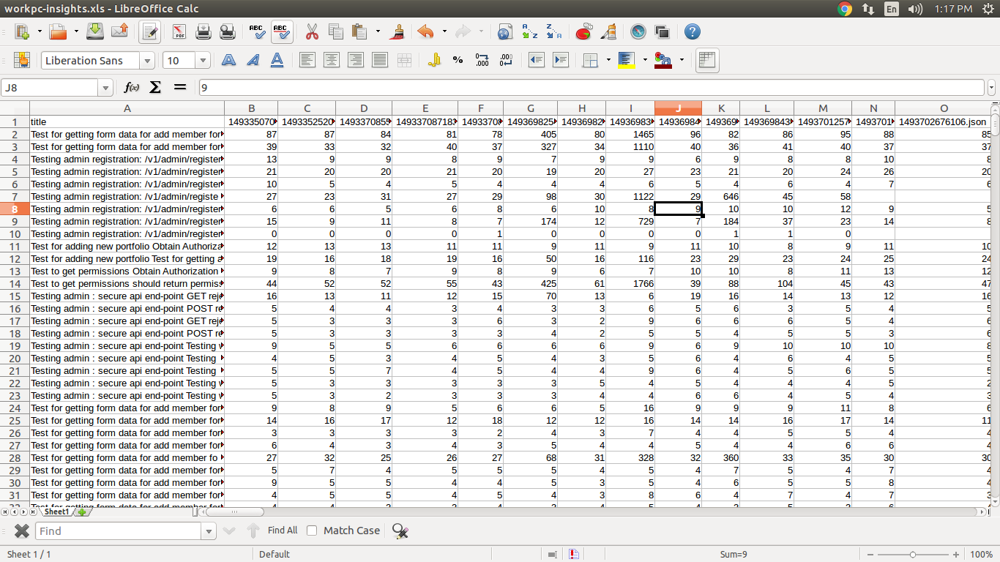

# mocha-insights-reporter
A pluggable Mocha reporter that give insights on the app performance based on duration of tests, and gives the result as an excel file. You may use your favorite reporter, `insights` run in background.

> This package is in Beta, but I invite you to give this a try and [submit your ideas](https://github.com/vajahath/mocha-insights-reporter/issues).




## The idea
`mocha-insights-reporter` is a reporter for mocha. It gives you performance matrix of your app based on each test cases duration.
 - it creates logs whenever you run tests with this reporter included.
 - you don't have to change your code to integrate this reporter.
 - usually run silently and wont output wired stuff to console and make it ugly.
 - by default, it generates `mocha-insights` directory in your application root (you may *gitignore* this directory).
 - every logs and reports will be stored there.
 - separate logs and reports for different `NODE_ENV` environment.
 - run `mocha-insights` to compile the report from logs.

## How to setup?

### step 1: get stuffs
You need the following dependencies to get this running.
 - [`mocha`](https://mochajs.org/) : our awesome test framework,
 - `mocha-insights-reporter` : (this package) and 
 - [`mocha-multi`](https://www.npmjs.com/package/mocha-multi) : get multiple reporters working with mocha

Get them all.
```
npm install --save-dev mocha mocha-insights-reporter mocha-multi
```

### step 2: integrate
#### Assumptions
 - Assuming you are already using the default `spec` reporter. Else change the setup accordingly. Its simple.
 - Assuming your tests are at `./tests` directory.

#### Setup
 - open your `package.json`
 - create or modify your `test` and `insights` tag under the `scripts` section as follows.
 ```json
 "scripts": {
		....
		"test": "./node_modules/.bin/mocha ./tests --recursive --reporter mocha-multi --reporter-options spec=-,mocha-insights-reporter=-",
		"insights": "./node_modules/.bin/mocha-insights",
         ....
}
 ```
> Note that `mocha-insights-reporter` needs to output end result to the console. So please use `... mocha-insights-reporter=-` while using with `mocha-multi`.

To know more about how `mocha-multi` works, please refer their doc.
### step 3: run
#### Run tests
 ```
 npm test
 ```
 to run your predefined test suit and generate log of that at `./mocha-insights/logs/{NODE_ENV}/` folder.

#### Generate report
 ```
 npm run insights
 ```
 to generate report in the excel format at `./mocha-insights/` folder.

 ## Licence
 MIT &copy; [Vajahath Ahmed](https://twitter.com/vajahath7)